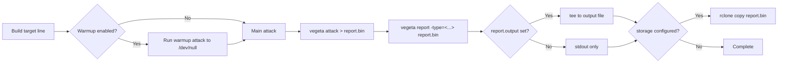
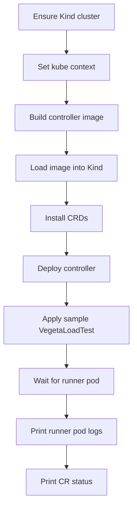

# kattack - In-Depth Technical Details

This document explains the codebase architecture, reconciliation flow, runner job behavior, status model, and operational workflows.

## 1. Project Overview

`kattack` is a Kubernetes operator (Kubebuilder/controller-runtime) for declarative HTTP load testing with Vegeta.

Primary object:
- API Group/Version: `loadtest.io/v1alpha1`
- Kind: `VegetaLoadTest`
- Plural: `vegetaloadtests`

Core idea:
- You declare phases/targets in a CR.
- The controller creates one Kubernetes Job per target (sequentially).
- Runner pod logs are parsed and persisted into CR `status.results[]`.
- Thresholds are evaluated and overall status is computed.

## 2. High-Level Architecture

```mermaid
flowchart TD
  A[VegetaLoadTest CR] --> B[Controller Reconcile Loop]
  B --> C[Create/Watch Runner Jobs]
  C --> D[Runner Pod Executes Vegeta]
  D --> E[Pod Logs + Report Output]
  E --> F[Parse Report]
  F --> G[Update status.results[]]
  G --> H[Evaluate Thresholds]
  H --> I[Update status.phase + status.thresholdsPassed]
```

Main components:
- API types: `api/v1alpha1/vegetaloadtest_types.go`
- Reconciler: `internal/controller/vegetaloadtest_controller.go`
- Job spec + command builder: `internal/controller/job_builder.go`
- Log/report parser: `internal/controller/report_parser.go`
- Threshold evaluator: `internal/controller/threshold_evaluator.go`
- Scheduler helpers: `internal/controller/scheduler.go`
- Notifications: `internal/controller/notifier.go`

## 3. Reconcile State Machine

The reconciler performs a target-by-target state machine.

```mermaid
flowchart TD
  A[Fetch CR] --> B{Deleting?}
  B -->|Yes| C[Cleanup owned jobs + remove finalizer]
  B -->|No| D[Ensure finalizer]
  D --> E{Scheduled + suspended?}
  E -->|Yes| F[Set phase Suspended]
  E -->|No| G[Set/keep phase Running]
  G --> H[Iterate spec.targets[] sequentially]
  H --> I{Job exists for target?}
  I -->|No| J[Create Job]
  I -->|Yes| K{Job running?}
  K -->|Yes| L[Requeue]
  K -->|No| M[Fetch logs + parse report]
  M --> N[Evaluate thresholds]
  N --> O{Failed + retries left?}
  O -->|Yes| P[Delete job + retry later]
  O -->|No| Q[Store result + counters]
  Q --> R{More targets?}
  R -->|Yes| H
  R -->|No| S[Compute overall status + completion time]
  S --> T[Send notifications if configured]
  T --> U[Patch status]
```

Important behavior:
- Sequential phases via `spec.targets[]`.
- `continueOnFailure` and `waitAfter` are honored.
- Global and per-target thresholds are merged for evaluation.
- Retries controlled by `spec.executionPolicy.retries` and `retryDelay`.

## 4. Runner Job Construction

Each target creates one Job with deterministic labels:
- `app=kattack`
- `vegetaloadtest=<cr-name>`
- `target=<target-name>`

Name pattern:
- `<cr-name>-<target-name>-<index>`

Default runner image:
- `docker.io/peterevans/vegeta:latest`

### Runner command flow



Design intent:
- Human-readable logs in pod output.
- Machine-usable data parsed into CR status.

## 5. CRD Spec Surface

Supported major spec sections:
- `targets[]`
- `attack`
- `report`
- `thresholds`
- `executionPolicy`
- `schedule`
- `storage`
- `notifications`
- `resources`
- `image`
- `historyLimit`
- `ttlSecondsAfterFinished`

Comprehensive sample:
- `config/samples/loadtest_v1alpha1_dummy_healthz.yaml`

## 6. Status Model

Key status fields:
- `status.phase`
- `status.currentTarget`
- `status.targetsTotal/Completed/Passed/Failed`
- `status.results[]` per target
- `status.thresholdsPassed`
- `status.overallSuccessRate`
- `status.conditions`

`status.results[]` includes:
- Latencies (`p50/p90/p95/p99/mean/max/min`)
- Throughput
- Request totals/success
- Success/error rate
- Status code map
- `thresholdsPassed`
- `thresholdBreaches[]`
- `jobName`

## 7. Notifications and Storage

Notifications:
- Slack webhook
- Generic webhook
- Email (spec fields)

Storage:
- `s3`, `gcs`, `azure`, `local` abstraction
- Optional credential secret and env injection

## 8. Runtime Resources in Cluster

When deployed with Kustomize (`make deploy`):
- Namespace: `kattack-system`
- Deployment: `kattack-controller-manager`
- ServiceAccount + RBAC + CRD + metrics service patches

Runner jobs/pods execute in the namespace of the CR.

## 9. Scripted Local Workflow

### Start + test flow

Script:
- `scripts/start_and_test.sh`

Flow:


### Build + apply only

Script:
- `scripts/build_and_apply.sh`

Purpose:
- Build image
- (Optional) load image to Kind
- Apply CRDs + deploy
- (Optional) apply run manifest

### Cleanup

Script:
- `scripts/cleanup_start_and_test.sh`

Removes:
- CR + runner jobs/pods
- Operator deployment + CRDs
- Optional Kind cluster
- Optional local image

## 10. Testing Strategy

Current tests:
- Unit tests under `internal/controller/*_test.go`
- E2E framework under `test/e2e`

Typical command:
- `go test ./...`

## 11. Known Constraints / Notes

- Go module path is `github.com/loadtest-io/kattack`.
- Custom Prometheus metric collector function is currently no-op.
- Adaptive RPS logic is roadmap, not active behavior.

## 12. File Map (Quick Navigation)

- `cmd/main.go` - manager bootstrap
- `api/v1alpha1/vegetaloadtest_types.go` - API schema
- `internal/controller/vegetaloadtest_controller.go` - reconcile engine
- `internal/controller/job_builder.go` - job + command generation
- `internal/controller/report_parser.go` - log parsing
- `internal/controller/threshold_evaluator.go` - threshold logic
- `scripts/start_and_test.sh` - full local run loop
- `scripts/build_and_apply.sh` - build + deploy helper
- `scripts/cleanup_start_and_test.sh` - cleanup helper
- `config/samples/loadtest_v1alpha1_dummy_healthz.yaml` - rich sample CR
